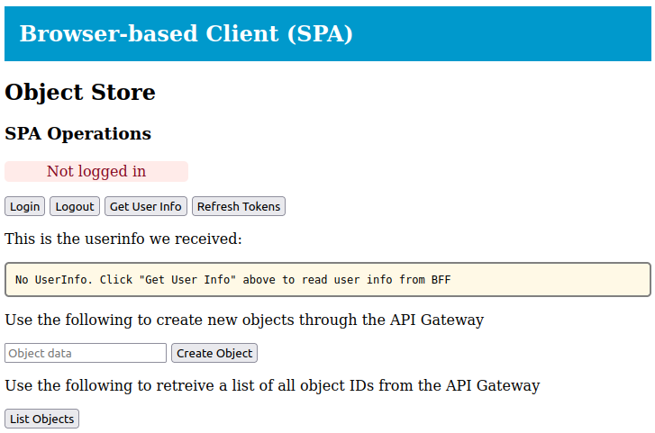
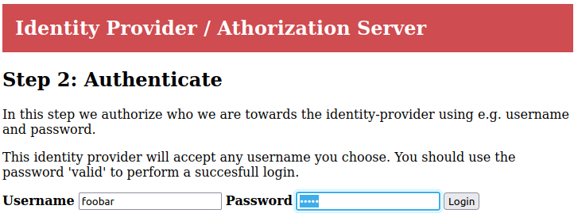
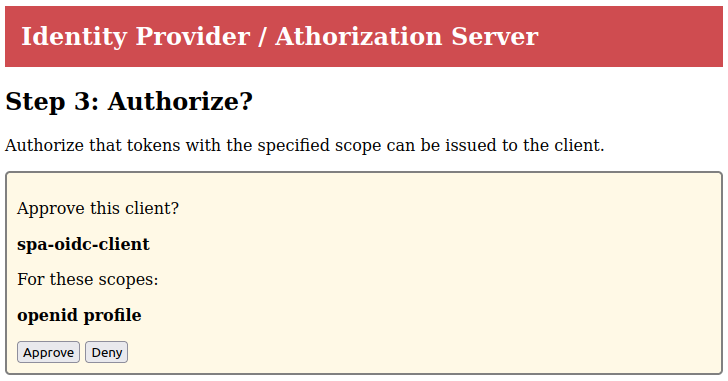
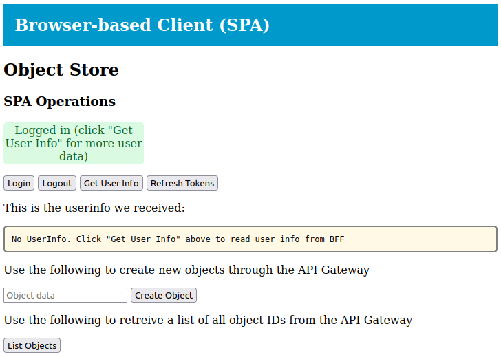
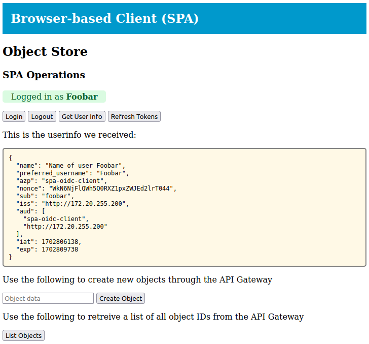

# Single-page Application with OIDC login using backend-for-frontend (BFF)

This repo contain a demonstration of a single-page application (SPA)
using login with OIDC through a backend-for-frontend (BFF).

## Prerequisites

The demonstration use the identity-provider from
[michaelvl/oidc-oauth2-workshop](https://github.com/michaelvl/oidc-oauth2-workshop.git)
and the BFF from
[michaelvl/oidc-oauth2-bff](https://github.com/michaelvl/oidc-oauth2-bff.git)

Get a copy of these repositories:

```
git clone https://github.com/michaelvl/oidc-oauth2-workshop.git
git clone https://github.com/michaelvl/oidc-oauth2-bff.git
git clone https://github.com/michaelvl/oidc-bff-apigw-workshop.git
```

This demonstration require a Kubernetes cluster with a gateway
implementation using gateway-API, e.g. Istio. A KIND cluster with
Istio and MetalLB can be provisioned using the following make targets:

```
make -C oidc-bff-apigw-workshop   create-cluster deploy-metallb deploy-istio-base
```

## Deploy Identity Provider

First, deploy the identity-provider Gateway, note that the
identity-provider use its own Gateway since it conceptually is a
separate function from the SPA itself:

```
kubectl apply -f oidc-oauth2-workshop/kubernetes/identity-provider-gateway.yaml
```

Wait until the Gateway is created, then set an environment variable
with the IP of the identity-provider Gateway and deploy the
identity-provider itself:

```
export IDENTITY_PROVIDER_GATEWAY_IP=$(kubectl get gateway idp -o jsonpath='{.status.addresses[0].value}')
echo "Identity provider IP: $IDENTITY_PROVIDER_GATEWAY_IP"

cat oidc-oauth2-workshop/kubernetes/identity-provider.yaml | envsubst | kubectl apply -f -
```

## Deploy SPA Backend Resources

Next, deploy the Gateway for the SPA:

```
kubectl apply -f oidc-bff-apigw-workshop/kubernetes/gateway-httproutes.yaml
```

Wait until the Gateway is created, then set an environment variable
with the IP of the SPA backend Gateway:

```
export SPA_GATEWAY_IP=$(kubectl get gateway spa -o jsonpath='{.status.addresses[0].value}')
echo "SPA IP: $SPA_GATEWAY_IP"
```

Next, deploy the SPA backend component; `cdn` provides static web
resource, `login-bff` provides an OIDC implementation, `redis`
provides a cookie session storage shared between `bff` and `api-gw`:

```
kubectl apply -f oidc-bff-apigw-workshop/kubernetes/spa-cdn.yaml
kubectl apply -f oidc-bff-apigw-workshop/kubernetes/spa-redis-session-store.yaml
cat oidc-bff-apigw-workshop/kubernetes/spa-login-bff.yaml | envsubst | kubectl apply -f -
```

Finally, deploy the API gateway (which adds an OIDC token header) and
the protected API (which authorizes access using OIDC tokens):

```
kubectl apply -f oidc-bff-apigw-workshop/kubernetes/spa-api-gw.yaml
cat oidc-bff-apigw-workshop/kubernetes/protected-api.yaml | envsubst | kubectl apply -f -
```

## Debugging

```
stern -l app=spa-login-bff
stern -l app=spa-api-gw
stern -l app=protected-api
```

## Trying it Out!

With all components deployed, open the IP stored in environment
varible `SPA_GATEWAY_IP` in a browser. Expect it to look like
below. The `Object Store` title refers to that this client allow us to
read and write objects in an object-store (a 'protected API' that
require OIDC login).

> 

Click `login` and you will be taken to the identity provider where you
can login. You can use any `name` and the password `valid` to login as
`name`:

> 

The identity provider ask us to authorize the clients use of our data:

> 

After authorizing the client, we are taken back to the SPA. The SPA
have not yet loaded any userdata and thus cannot present the `name` of
the logged-in user yet:

> 

Click `Get User Info` to load user information and let the SPA show
the logged-in user name:

> 

Try clicking `List Objects` to list the currently defined objects in
the protected API. Initially a single object is created, and the UUID
of this object will be shown. Use the `Create Object` to create
additional objects.
